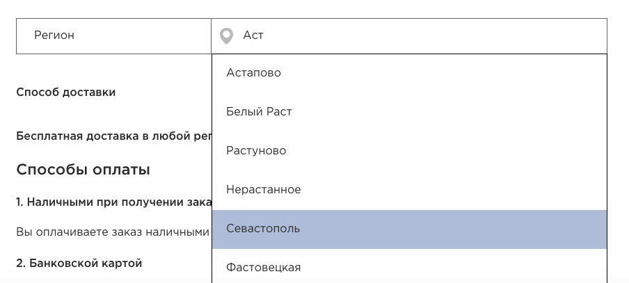

# bitrix.main.lookup.input
Автозаполнение (привязка к элементам)

Бывает требуется добавить функционал автозаполнения (подсказка, которая всплывает под инпутом, когда мы что-то туда вписываем). Браузеры сами имеют такую опцию, но у нас стоит задача -  <b>сделать подсказки из определенного инфоблока</b>.
Если у Вас есть такая задача, здесь вы найдете простое решение здесь. :)

В админке битрикса уже имеется компонент, который выполняет эту функцию. Мы скопируем его в своё пространство имен.

Путь:
```
/bitrix/components/bitrix/<b>main.lookup.input</b>/templates/iblockedit/ajax.php
```
1. Копируем компонент main.lookup.input в своё пространство имён и переходим в файл ajax.php:

В конце находим строку:
```php
echo Main\Web\Json::encode($arResult);;
```
Меняем на:

```php
echo json_encode($arResult);
```

2. Добавляем к нашему инпуту еще один скрытый инпут и блок, в который будут подгружаться предлогаемые варианты:

```
<input id="ajaxInput" type="text" value="">
<input type="hidden" id="ajaxInputIblock" value="<?=IBLOCK_GAMES?>">
<div class="mli-search-result-input"></div>
```

3. Теперь нам нужно написать функцию, который отправляет через метод GET данные в этот обработчик и принимает json данные и раскладывает в массив js;

```js
$(document).ready(function(){
    var search,iblock_id, mode, type, admin, lang, site;

    $('#ajaxInput').on('keyup',function(){
        search = $('#ajaxInput').val();
        iblock_id = $('#ajaxInputIblock').val();
        mode = 'SEARCH';
        type = 'ELEMENT';
        admin = 'Y';
        lang = 'ru';
        site = 'ru';

            $.ajax({
                url: "/bitrix/components/пространство_имен/main.lookup.input/templates/iblockedit/ajax.php",
                type: "GET",
                dataType: "json",
                data: {IBLOCK_ID:iblock_id, MODE:mode, TYPE:type, admin:admin, lang:lang, search:search, site:site},
            }).done(function(data){
                $('.mli-search-result-input').text('');
					      $('.mli-search-result-input').addClass('active');
                var html = "";
                // Скрытие всплывающего окна, если кликнули мимо
                $(document).mouseup(function (e){ 
			var div = $(".mli-search-result-games"); // тут указываем ID элемента
			if (!div.is(e.target) // если клик был не по нашему блоку
			    && div.has(e.target).length === 0) { // и не по его дочерним элементам
				div.removeClass('active'); // скрываем его
			}
		});
                
                for (var i=0; i < data.length; i++){
                    if(typeof data[i].NAME !== 'undefined'){
                        html += "<div data-inputID="+data[i].ID+" class='itemInput itemInput"+i+"'>"+[data[i].NAME].toString()+"</div>";
                    }
                }
                $('.mli-search-result-input').append(html);
            });
    });
    $('.mli-search-result-input').on('click',".itemInput", function(){
       var input_id = $(this).attr("data-inputID");
       var input_name = $(this).text();
       $('#ajaxInputResult').val(input_id);
       $('.mli-search-result-input').removeClass('active');
       $('#ajaxInput').val(input_name);
       // Какая нибудь отправка данных, если это не обходимо, должна быть тут
    });
    
    // Выбрать первый предложенный элемент при нажатии на ENTER
    $('#ajaxInput').on('keyup',function(){
      $(this).keypress(function(event){
        var keycode = (event.keyCode ? event.keyCode : event.which);
        if(keycode == '13'){
            $('.itemInput').click(); 
            $('#ajaxInput').blur();
        }
      });
    });    
    
});
```

4. Наш функционал по идее расчитан под АДМИНИСТРАТОРА! поэтому нужно не забыть передать права. (Этот момент я заметил не сразу)

Перед строкой:
```php
if ($iblockId > 0)
```
Вставляем:

```
$iblockAccessLevel = 'element_read'; 
$filter = array(
	'CHECK_PERMISSIONS' => 'Y',
	'MIN_PERMISSION' => 'R'
);
```
